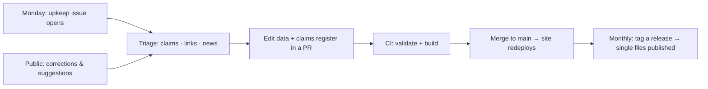

# Maintaining fieldworks as a living document

fieldworks stays accurate only if it is touched on a schedule. Automation finds the work; a human decides what changes. The routine below takes about 30 minutes a week plus a short monthly release.



## Cadence

| When | What | Time |
|---|---|---|
| **Weekly** (Monday issue) | Work through the upkeep issue: verify due claims, fix links, triage news. Triage new correction / new-entry issues. | ~30 min |
| **Monthly** | Cut a release (below), even if small. A visible release history is what makes this credible as a living document. | ~10 min |
| **Quarterly** | Claims verified ≥ 90 days ago come back in the weekly issue automatically; clear them. Review the feed list in `upkeep/watch.json`. | spread over weekly sessions |
| **Yearly** | Review every `~ … (estimate)` cost figure in quarry; review known gaps in both projects' `docs/maintenance.md` and decide on new layers or archetypes; refresh the social-preview images. | half a day |

## The weekly upkeep issue

The **Weekly upkeep** workflow (`.github/workflows/upkeep.yml`) opens an issue labelled `upkeep` every Monday at 07:00 UTC. Run it on demand from the Actions tab, or locally:

```sh
node tools/validate.mjs --index dist/index.json
python3 tools/upkeep.py report --days 7      # or: claims | links | watch
```

The issue has three sections. Tick items as you go; one PR can resolve many items. Close the issue when done.

### Claims to verify

Each item is a dated fact from [`upkeep/claims.json`](upkeep/claims.json) that has never been verified (`status: "compiled"`) or was last verified more than `review_interval_days` (90) ago.

For each claim:
1. Check it against a primary source.
2. If the catalogue is wrong, fix the entry's text in the data file.
3. Update the claim: rewrite the `claim` text if needed, set `"status": "verified"`, set `"checked"` to today, and add the source URL(s) to `"sources"`.
4. If the fact no longer matters, delete the claim (and the catalogue text that depends on it).

New dated facts added to the catalogue get a claim in the same PR (the PR template asks).

### Links

Every catalogue URL is fetched. For GitHub repositories, the API is also queried for archived status.
- **Broken:** fix or remove the URL.
- **Archived repositories:** update the entry to say so (see `t_telethon`), then add the id to `archived_ok` in [`upkeep/links.json`](upkeep/links.json).
- **Blocked:** bot protection (HTTP 403/429/503). Open the URL in a browser; if the site works, add the id to `blocked_ok`.

Acknowledged ids stay hidden until you remove them, so the section only shows new problems.

### News watch

The news watch scans the feeds in [`upkeep/watch.json`](upkeep/watch.json) (regulators, courts via CourtListener searches, security press, OSINT community, privacy/tech press). It reports items from the last 7 days that mention a catalogued vendor or tool (names are taken from the validator's index automatically) or a watched topic keyword. Bold terms are catalogued entities.

For each item, decide one of:
- **No change.** Just tick it.
- **Update an entry.** Change the text, rating, recipe or vendor evidence level, and add or refresh the claim.
- **New entry.** Add it, or open a new-entry issue to do later.
- **New claim.** Register a dated fact you want re-checked later.

Tuning the watch:
- Too noisy: add generic names to `ignore_names`, or remove broad keywords.
- Too quiet: add feeds or keywords.
- `"all": true` on a feed reports every item (use it only for low-volume, high-relevance feeds), and `"ua": "browser"` is for feeds that reject bots (FTC).
- Feeds that fail are listed at the end of the section.

## Public contributions

- **Corrections:** triage within a week. Accept on evidence (see [CONTRIBUTING.md](CONTRIBUTING.md#evidence-standard)). Reply with what changed and close the issue, linking the PR.
- **Vendor objections:** treat them like any other correction. A credible contrary source removes an `inferred` attribution or changes its evidence level. Accurate, sourced facts stay. Keep the discussion on the issue.
- **New entries:** apply the inclusion rule in each project's curation rules. Label `new-entry` issues you accept but haven't done yet as a backlog.

## Releases

Versioning is calendar-based: `vYYYY.MM.N` (e.g. `v2026.10.0`; `N` counts releases within the month).

1. Make sure `main` is green (CI).
2. Update `CHANGELOG.md` at the root (and the project changelogs for content changes) under the new version.
3. Tag and push:
   ```sh
   git tag v2026.11.0 && git push origin v2026.11.0
   ```
4. The **Release** workflow builds both single-file HTML files, stamps them with the version and attaches them to a GitHub Release with generated notes.

The website redeploys on every push to `main`. Release tags only drive the downloadable files and the release history.

## Build stamp

Pages show their build in the header (and on the landing page): `git describe` plus the UTC date, e.g. `v2026.10.0-3-gabc1234 · 2026-10-21`. Opening a source file directly shows `dev`. Readers can always tell how fresh their copy is, including a downloaded single file.

## Going public (one-time)

1. Settings → General → Danger zone → make the repository public.
2. Settings → Pages → Build and deployment → Source: **GitHub Actions**.
3. Actions → **Deploy site** → Run workflow (later deploys happen on every push to `main`). The site appears at `https://hexacron.github.io/fieldworks/`.
4. For a custom domain:
   - add it under Settings → Pages;
   - set the repository variable `SITE_URL` (Settings → Secrets and variables → Actions → Variables) to the full `https://` URL, so social-preview tags and upkeep deep links use it;
   - re-run **Deploy site**.
5. Check the social preview with a link-preview debugger (e.g. LinkedIn Post Inspector) for `/`, `/fieldguide/` and `/quarry/`.
6. Tag the first public release.

## Social-preview images

The images are in `assets/` (`og-fieldworks.jpg`, `og-fieldguide.jpg`, `og-quarry.jpg`, 1200×630). They are screenshots, so refresh them when the UI changes noticeably:
- **fieldguide:** the map with the legend collapsed.
- **quarry:** the Supply chain view in Families mode.
- **fieldworks:** the landing page.

Capture each at 1680×882 (or any 1.905 aspect ratio) without the build stamp, then scale to 1200×630 JPEG:
`sips -z 630 1200 -s format jpeg -s formatOptions 85 in.png --out assets/og-….jpg`.

## Tool reference

| Command | Purpose |
|---|---|
| `node tools/validate.mjs [--index dist/index.json]` | Validate both catalogues, the claims register and upkeep config; optionally write the entity index used by upkeep. Exit 1 on errors. |
| `python3 tools/build.py [--site] [--stamp TEXT] [--site-url URL]` | Single-file bundles into `dist/`; with `--site`, the full website into `_site/`. |
| `python3 tools/upkeep.py claims\|links\|watch\|report [--days N] [--out FILE]` | The weekly checks, individually or as one report. |

All tools use only Node 18+ / Python 3.9+ standard libraries.
